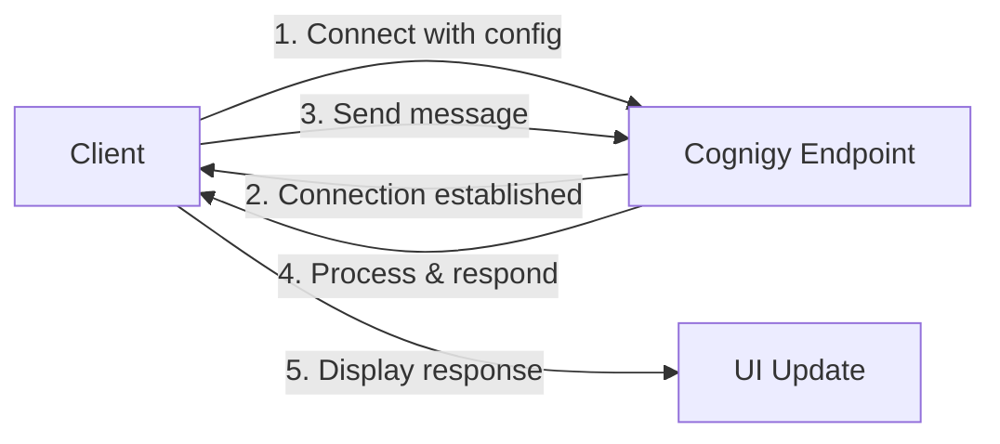

# Cognigy WebSocket Client - System Architecture

## 📁 Project Structure

```
cognigysocketio/
├── public/
│   ├── index.html     # Main HTML layout
│   ├── app.js         # Core application logic
│   └── styles.css     # Styling and animations
├── .env               # Environment configuration
├── .gitignore        # Git ignore rules
├── package.json      # Dependencies and scripts
├── README.md         # User documentation
└── SYSTEM.md         # Technical documentation
```

## 🔄 Data Flow

### WebSocket Communication


1. **Connection Initialization**
   - Load configuration from localStorage/environment
   - Establish WebSocket connection with Cognigy endpoint
   - Handle connection events (connect, disconnect, error)

2. **Message Flow**
   - User input (text/voice) → Message formatting
   - WebSocket emission → Cognigy processing
   - Response reception → UI update
   - JSON panel synchronization

3. **State Management**
   - Configuration persistence in localStorage
   - Session maintenance
   - User preferences (avatar style, disclaimer settings)

## 🎨 Frontend Architecture

### Component Layout
```
+------------------------------------------+
|                Header                     |
|  +------------+       +--------------+    |
|  |            |       |              |    |
|  |   Chat     |       |    JSON      |    |
|  | Interface  |       |   Monitor    |    |
|  |            |       |              |    |
|  |            |       |              |    |
|  |            |       |              |    |
|  +------------+       +--------------+    |
|          Input Area                       |
+------------------------------------------+
```

### UI Components

1. **Chat Interface**
   - Message container (scrollable)
   - Message bubbles with avatars
   - Timestamp displays
   - Quick reply buttons
   - Adaptive cards support

2. **Input System**
   - Text input field
   - Voice input button
   - Send button with animation
   - Input validation

3. **JSON Monitor**
   - Toggle buttons (Outgoing/Incoming)
   - JSON formatting
   - Syntax highlighting
   - Auto-scroll on update

4. **Configuration Panel**
   - Input fields for endpoint details
   - Password visibility toggle
   - Save/Reset functionality
   - Validation feedback

## 🛠 Core Components

### 1. WebSocket Handler
```javascript
// Socket initialization with configuration
function initializeSocket(config) {
    socket = io(config.endpoint, {
        transports: ['websocket'],
        query: {
            'urlToken': config.token,
            'sessionId': config.sessionId,
            'userId': config.userId
        }
    });
    // Event handlers setup
}
```

### 2. Speech Recognition System
```javascript
// Speech recognition initialization
function initializeSpeechRecognition() {
    if ('webkitSpeechRecognition' in window) {
        recognition = new webkitSpeechRecognition();
        recognition.continuous = false;
        recognition.interimResults = true;
        // Event handlers and UI updates
    }
}
```

### 3. Message Handler
```javascript
// Message processing and display
function appendMessage(text, isUser, data) {
    // Create message elements
    // Apply styling and animations
    // Handle special message types
    // Update UI and scroll position
}
```

## 🎯 Event System

### User Interactions
- Message submission
- Voice recording
- Configuration updates
- Avatar customization
- JSON panel toggling

### WebSocket Events
- Connection status
- Message reception
- Error handling
- Reconnection logic

### Speech Recognition Events
- Start/Stop recording
- Results processing
- Error handling
- UI state updates

## 🎨 Styling System

### CSS Architecture
1. **Base Styles**
   - Reset and normalization
   - Typography
   - Color variables
   - Layout fundamentals

2. **Component Styles**
   - Message bubbles
   - Input controls
   - Buttons and icons
   - Modal and panels

3. **Animations**
   - Message transitions
   - Button effects
   - Recording indicator
   - Loading states

### Theme Variables
```css
:root {
    /* Core colors */
    --cognigy-chat-color-surface: #ffffff;
    --cognigy-chat-color-primary: #6366f1;
    
    /* Message colors */
    --cognigy-chat-color-bot-message: #f4f4f4;
    --cognigy-chat-color-user-message: #6366f1;
    
    /* Status colors */
    --success-color: #10b981;
    --error-color: #e32f45;
}
```

## 🔒 Security Considerations

1. **Data Protection**
   - Environment variables for sensitive data
   - Token handling in WebSocket connection
   - Input sanitization

2. **Error Handling**
   - Connection failure recovery
   - Invalid input prevention
   - Graceful degradation

3. **Browser Compatibility**
   - Feature detection for speech recognition
   - Fallback mechanisms
   - Cross-browser testing

## 🔄 State Management

### Local Storage
- Configuration persistence
- User preferences
- Disclaimer settings
- Session information

### Runtime State
- Connection status
- Message history
- Recording status
- UI state (panels, modals)

## 📱 Responsive Design

### Breakpoints
```css
/* Mobile first approach */
@media (min-width: 640px) { /* Tablet */ }
@media (min-width: 1024px) { /* Desktop */ }
@media (min-width: 1280px) { /* Large screens */ }
```

### Layout Adaptations
- Flexible grid system
- Dynamic component sizing
- Touch-friendly interfaces
- Responsive typography

## 🚀 Performance Optimization

1. **Resource Loading**
   - Asynchronous script loading
   - CSS optimization
   - Image optimization
   - Caching strategies

2. **Runtime Performance**
   - Efficient DOM updates
   - Debounced event handlers
   - Memory management
   - Animation optimization

## 🧪 Testing Considerations

1. **Unit Testing**
   - WebSocket handlers
   - Message formatting
   - State management
   - UI components

2. **Integration Testing**
   - End-to-end flows
   - WebSocket communication
   - Speech recognition
   - UI interactions

3. **Browser Testing**
   - Cross-browser compatibility
   - Responsive design
   - Feature detection
   - Error scenarios
